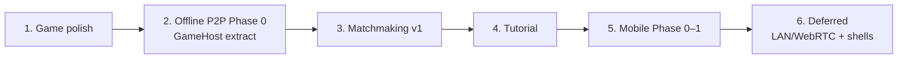
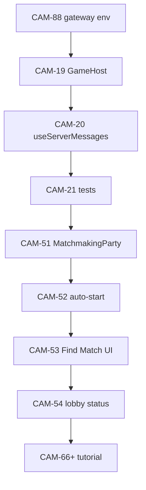

# Cambio project priority discovery

**Generated:** 2026-08-11  
**Source of truth:** [Project priority order](https://linear.app/ebrierton-cambio/document/project-priority-order-67a9122bb396)  
**Repo:** https://github.com/evanbrierton/cambio  
**Prod:** https://cambio.brierton.ie  
**Verified against:** `main` @ discovery time (local checkout clean, up to date with `origin/main`)

## Executive summary

Ship remaining Cambio work in this order to avoid rework:

**polish → GameHost extract (Offline P2P Phase 0) → Matchmaking v1 → Tutorial → Mobile Phase 0–1 → defer Offline LAN/WebRTC and native shells**

Structural extractions (`GameHost`, `useServerMessages`) must land before Matchmaking auto-start/bot-fill logic piles into `party/cambio.ts`. Home/lobby UI (Find Match) must settle before Tutorial coach overlays target those CTAs.



## Stack (verified on main)

| Layer | Path / tool |
| --- | --- |
| Web app | Next.js **16.3.0** App Router (`src/app/`) |
| Game authority | PartyKit / Cloudflare DO — `party/cambio.ts` via `partyserver` |
| Shared game logic | `src/game/` (pure TS; **1618 LOC** in `engine.ts`) |
| Client connection | `src/hooks/useGameConnection.ts` (**450 LOC**) |
| WS validation | `src/game/wire-schema.ts` (zod; CAM-85 Done) |
| UI prefs | `src/store/ui-prefs.ts` (zustand persist; CAM-82 Done) |
| Quality gate | `pnpm lint && pnpm typecheck && pnpm test` |
| Deploy | Vercel (Next) + Wrangler (party worker) |

## Conventions for workers

| Item | Value |
| --- | --- |
| Linear IDs | `CAM-n` |
| Feature branches | `evanbrierton/cam-<n>-<slug>` |
| Orchestration branches | `orch/project-priority/<task>` |
| Linear workflow | **In Progress** when coding; **In Review** when draft PR open |
| PRs | Draft PR base `main` via ManagePullRequest tool |

---

## Phase 1 — Game polish

**Goal:** Lock correct engine/UI behavior and finish safe library adoption before freezing authority in `GameHost`.

**Linear project:** Game polish  
**Status on main:** Nearly complete — **one P0 issue remains** (CAM-88).

### Done — do not reopen

Verified **Done** in Linear and present on `main`:

| ID | Title | Notes |
| --- | --- | --- |
| [CAM-82](https://linear.app/ebrierton-cambio/issue/CAM-82) | zustand persist for UI prefs | `src/store/ui-prefs.ts`; old `src/lib/hints.ts` removed |
| [CAM-81](https://linear.app/ebrierton-cambio/issue/CAM-81) | cookies-next theme cookie | Merged with CAM-83 in PR #166 |
| [CAM-83](https://linear.app/ebrierton-cambio/issue/CAM-83) | next-themes for style themes | `next-themes` in deps |
| [CAM-84](https://linear.app/ebrierton-cambio/issue/CAM-84) | lucide-react chrome icons | `lucide-react` in deps |
| [CAM-85](https://linear.app/ebrierton-cambio/issue/CAM-85) | zod WS + bot settings validation | Schemas in `src/game/wire-schema.ts` |
| [CAM-64](https://linear.app/ebrierton-cambio/issue/CAM-64) | Host-configurable card points | Lobby + engine wired |
| [CAM-75](https://linear.app/ebrierton-cambio/issue/CAM-75) | Distinct swap VFX/SFX | Done 2026-08-11 |
| [CAM-87](https://linear.app/ebrierton-cambio/issue/CAM-87) | Bot chat private-card leak fix | LLM prompt constraints |
| [CAM-76](https://linear.app/ebrierton-cambio/issue/CAM-76) | Abilities must not fire on swap-out | Engine fix |
| [CAM-77](https://linear.app/ebrierton-cambio/issue/CAM-77) | Discard button copy for abilities | Theme voice strings |

Parent epic [CAM-80](https://linear.app/ebrierton-cambio/issue/CAM-80) library adoption: children above merged; epic itself still **Backlog** in Linear (tracking only).

### Remaining in phase 1

| ID | Est. | Status | Title |
| --- | --- | --- | --- |
| **[CAM-88](https://linear.app/ebrierton-cambio/issue/CAM-88)** | S | **Todo** | Route bot chat LLM through Vercel AI Gateway |

**CAM-88 implementation notes (verified on main):**

- `src/game/bot-chat-llm.ts` still `fetch`es `https://api.groq.com/openai/v1/chat/completions` with model `llama-3.1-8b-instant`.
- `party/cambio.ts` passes `this.env.GROQ_API_KEY` into `generateBotChatMessage`.
- `party/env.d.ts` declares `GROQ_API_KEY?: string`.
- **Must use Workers-compatible `AI_GATEWAY_API_KEY`** — Vercel OIDC does not apply inside the DO.
- Keep template fallback paths (`no_api_key`, rate limit, API errors) for offline/solo ([CAM-28](https://linear.app/ebrierton-cambio/issue/CAM-28)).
- Do not regress [CAM-87](https://linear.app/ebrierton-cambio/issue/CAM-87) private-card chat rules.
- Prefer OpenAI-compatible gateway HTTP; provider/model slug e.g. `groq/llama-3.1-8b-instant`.

**Files:** `src/game/bot-chat-llm.ts`, `party/cambio.ts`, `party/env.d.ts`, wrangler secrets / `.dev.vars`.

### Deferred polish (phase 1+)

| ID | Est. | Title | Why defer |
| --- | --- | --- | --- |
| [CAM-17](https://linear.app/ebrierton-cambio/issue/CAM-17) | XL | Sound/visual juice (framer-heavy) | Framer lock-in; decide Capacitor-first vs Expo before large juice pass |
| [CAM-55](https://linear.app/ebrierton-cambio/issue/CAM-55) | L | Dedicated `/settings` page | Consolidation after core polish |
| [CAM-57](https://linear.app/ebrierton-cambio/issue/CAM-57) | S | Style theme naming / picker IA | After appearance axis stable |
| [CAM-56](https://linear.app/ebrierton-cambio/issue/CAM-56) | XL | Server-synced prefs (auth) | Requires auth model |
| [CAM-86](https://linear.app/ebrierton-cambio/issue/CAM-86) | — | i18n / theme-voice library spike | Optional; keep custom `THEME_VOICES` for now |

---

## Phase 2 — Offline P2P Phase 0 (GameHost extract)

**Goal:** Extract transport-agnostic `GameHost` so `CambioParty` becomes a thin Cloudflare adapter. **Do NOT build LAN/WebRTC in this phase.**

**Linear project:** Offline P2P (parent [CAM-18](https://linear.app/ebrierton-cambio/issue/CAM-18))

**Prerequisite:** Phase 1 complete (especially CAM-88 env wiring in `party/cambio.ts` before the major refactor).

### Issues (strict order)

| Order | ID | Est. | Status | Title |
| --- | --- | --- | --- | --- |
| 1 | [CAM-19](https://linear.app/ebrierton-cambio/issue/CAM-19) | XL | Backlog | Extract `GameHost` from `CambioParty` |
| 2 | [CAM-20](https://linear.app/ebrierton-cambio/issue/CAM-20) | M | Backlog | Extract `useServerMessages` from `useGameConnection` |
| 3 | [CAM-21](https://linear.app/ebrierton-cambio/issue/CAM-21) | L | Backlog | `GameHost` unit tests + online smoke checklist |

### Key paths (verified absent on main)

| Path | State | Role |
| --- | --- | --- |
| `src/game/host.ts` | **Does not exist** | New `GameHost` class (zero partyserver/CF imports) |
| `party/cambio.ts` | **722 lines** | Today: room lifecycle, bots, alarms, persistence, bot chat |
| `src/hooks/useServerMessages.ts` | **Does not exist** | Shared inbound `ServerMessage` → UI state |
| `src/hooks/useGameConnection.ts` | **450 lines** | PartySocket + flash timers + message handling (to shrink) |
| `src/game/engine.ts` | 1618 lines | Pure rules; `GameHost` delegates here |
| `src/game/wire-schema.ts` | Exists | zod parse helpers for client/server messages |

### CAM-19 scope summary

Move from `party/cambio.ts` into `GameHost`:

- Player join/leave/reconnect, `dispatchMessage` → `handleMessage`
- Per-player `buildPlayerView` broadcast
- Secret peek, flash routing (`secret_peek`, `peek_flash`, `swap_flash`, etc.)
- Snap window scheduling (`expireSnapWindow`; DO alarms stay in adapter)
- Bot move + bot chat scheduling (optional gateway key → template fallback)
- `PeerConnection` interface: `{ playerId, send(msg), connected }`

Refactor `CambioParty` to adapter only: `onConnect` / `onMessage` / `onClose` / `onAlarm` / `persist()`.

### CAM-20 scope summary

Extract flash timer + state updates for: `state`, `room_info`, `secret_peek`, `peek_flash`, `swap_flash`, `penalty_flash`, `cambio_flash`, `reshuffle_flash`, `error`.  
`useGameConnection` keeps PartySocket lifecycle only; **exported API unchanged**.

### Explicitly out of scope (Phase 0)

| ID | Title |
| --- | --- |
| [CAM-22](https://linear.app/ebrierton-cambio/issue/CAM-22) | LAN WebSocket P2P transport |
| [CAM-23](https://linear.app/ebrierton-cambio/issue/CAM-23) | `useP2PConnection` hook |
| [CAM-26](https://linear.app/ebrierton-cambio/issue/CAM-26) | WebRTC DataChannel transport |

---

## Phase 3 — Matchmaking v1

**Goal:** FIFO stranger matchmaking via a thin `MatchmakingParty` DO; auto-start and bot fill on `CambioParty` once `GameHost` owns room lifecycle.

**Epic:** [CAM-50](https://linear.app/ebrierton-cambio/issue/CAM-50)  
**Design doc:** [Matchmaking v1 design](https://linear.app/ebrierton-cambio/document/matchmaking-v1-design-43b3ec2d1df6)

**Prerequisite:** Phase 2 complete (`CambioParty` thin over `GameHost`).

### v1 issues (P0 — ship Find Match)

| ID | Est. | Status | Title |
| --- | --- | --- | --- |
| [CAM-51](https://linear.app/ebrierton-cambio/issue/CAM-51) | XL | Backlog | `MatchmakingParty` DO + FIFO config buckets |
| [CAM-52](https://linear.app/ebrierton-cambio/issue/CAM-52) | L | Backlog | Auto-start matchmade lobbies + soft timeout + bot fill |
| [CAM-53](https://linear.app/ebrierton-cambio/issue/CAM-53) | L | Backlog | Find Match CTA + matchmaking client flow |
| [CAM-54](https://linear.app/ebrierton-cambio/issue/CAM-54) | L | Backlog | Matchmade lobby status UI + theme copy |

### Product defaults (v1)

- Target size: **4** (configurable 2–6)
- Fill with bots: **on** by default
- Soft start: **45s** after lobby start-eligible
- Abandon: **~3 min** alone when bot fill off
- Home: one **Find Match** CTA; config only on `/matchmaking`
- Bucket key: `(targetSize, fillWithBots)` — no cross-match

### New paths (not on main)

- `party/matchmaking.ts` (new DO)
- `src/app/matchmaking/page.tsx`
- `src/hooks/useMatchmaking.ts`

### Touch paths

- `party/worker.ts`, `party/env.d.ts`, `wrangler.toml`
- `src/app/page.tsx`, `src/app/play/[roomId]/page.tsx`
- `src/components/game/LobbyPlayers.tsx`, `GameTable.tsx`
- `src/lib/themes.ts` (voice keys for matchmaking copy)

### Deferred matchmaking (P2+)

| ID | Title |
| --- | --- |
| [CAM-61](https://linear.app/ebrierton-cambio/issue/CAM-61) | Rematch after matchmade games |
| [CAM-59](https://linear.app/ebrierton-cambio/issue/CAM-59) | Regional / latency routing |
| [CAM-62](https://linear.app/ebrierton-cambio/issue/CAM-62) | Bot difficulty on matchmaking screen |

Also tracked in design doc: CAM-58 ranked, CAM-60 party queue.

---

## Phase 4 — Tutorial

**Goal:** First-visit onboarding (landing modal + in-game Joyride coach + `/rules`). Client-only; no PartyServer changes.

**Epic:** [CAM-65](https://linear.app/ebrierton-cambio/issue/CAM-65)

**Prerequisite:** Phase 3 — home/lobby CTAs stable (Find Match, matchmade lobby status).

### Sub-issues (suggested order)

| ID | Est. | Status | Title |
| --- | --- | --- | --- |
| [CAM-66](https://linear.app/ebrierton-cambio/issue/CAM-66) | XS | Backlog | Persistence: `localStorage` + `useTutorial` |
| [CAM-68](https://linear.app/ebrierton-cambio/issue/CAM-68) | L | Backlog | Landing `TutorialModal` + How to play on home |
| [CAM-69](https://linear.app/ebrierton-cambio/issue/CAM-69) | M | Backlog | `/rules` page from README |
| [CAM-67](https://linear.app/ebrierton-cambio/issue/CAM-67) | L | Backlog | react-joyride v3 + `TutorialCoach` |
| [CAM-70](https://linear.app/ebrierton-cambio/issue/CAM-70) | M | Backlog | Integrate `TutorialCoach` into `GameTable` |
| [CAM-71](https://linear.app/ebrierton-cambio/issue/CAM-71) | S | Backlog | Polish: Skip/Escape, motion, mobile |

### Persistence keys

| Key | Purpose |
| --- | --- |
| `cambio-tutorial-home-seen` | Landing modal completed/skipped |
| `cambio-tutorial-game-seen` | In-game coach completed/skipped |

Module: `src/lib/tutorial.ts`, `src/hooks/useTutorial.ts` (both **absent** on main).

### Library note

`react-joyride` is DOM-only — acceptable for Capacitor-first; would need rewrite for Expo.

---

## Phase 5 — Mobile Phase 0–1

**Goal:** PWA audit, storage adapters, monorepo scaffold, extract `packages/game` + `packages/client`. **Defer Capacitor/Expo shells until web product shape stable.**

**Epic:** [CAM-32](https://linear.app/ebrierton-cambio/issue/CAM-32) (full mobile port — only Phase 0–1 in this priority slice)

| Order | ID | Est. | Title |
| --- | --- | --- | --- |
| 1 | [CAM-33](https://linear.app/ebrierton-cambio/issue/CAM-33) | M | Mobile web audit + PWA hardening |
| 2 | [CAM-34](https://linear.app/ebrierton-cambio/issue/CAM-34) | M | Platform storage + clipboard abstractions |
| 3 | [CAM-35](https://linear.app/ebrierton-cambio/issue/CAM-35) | L | Monorepo workspace scaffold |
| 4 | [CAM-36](https://linear.app/ebrierton-cambio/issue/CAM-36) | L | Extract `packages/game` |
| 5 | [CAM-37](https://linear.app/ebrierton-cambio/issue/CAM-37) | L | Extract `packages/client` |

**Prerequisite:** Prefer `GameHost` already in shared game code (Phase 2) before package extraction.

### Target layout (Phase 1+)

```
cambio/
├── packages/
│   ├── game/      ← from src/game/
│   └── client/    ← useGameConnection, party config, storage iface
├── apps/
│   ├── web/       ← Next.js (may stay at repo root initially)
│   └── mobile/    ← Phase 2+
└── party/         ← Cloudflare Workers (unchanged)
```

---

## Defer list (phase 6+)

Do **not** start until Phases 1–5 are substantially complete.

### Offline P2P Phase 1+

| ID | Title |
| --- | --- |
| [CAM-22](https://linear.app/ebrierton-cambio/issue/CAM-22) | LAN WebSocket P2P transport |
| [CAM-23](https://linear.app/ebrierton-cambio/issue/CAM-23) | `useP2PConnection` hook |
| [CAM-26](https://linear.app/ebrierton-cambio/issue/CAM-26) | WebRTC DataChannel transport |

### Mobile Phase 2+ (native shells)

| ID | Title |
| --- | --- |
| [CAM-38](https://linear.app/ebrierton-cambio/issue/CAM-38) | Capacitor iOS/Android shell |
| [CAM-39](https://linear.app/ebrierton-cambio/issue/CAM-39) | Capacitor native plugins |
| [CAM-40](https://linear.app/ebrierton-cambio/issue/CAM-40) | TestFlight / Play internal testing |
| [CAM-41](https://linear.app/ebrierton-cambio/issue/CAM-41) | Expo mobile scaffold |
| [CAM-42+](https://linear.app/ebrierton-cambio/issue/CAM-32) | Expo screen ports, NativeWind, deep links, push |

---

## Path contention

Strict sequencing on shared hot paths:

| Path | Phase 1 | Phase 2+ | Rule |
| --- | --- | --- | --- |
| `party/cambio.ts` | **CAM-88** (env wiring) | **CAM-19** (major refactor), then **CAM-52** (matchmaking flags) | CAM-88 **before** CAM-19 |
| `src/game/bot-chat-llm.ts` | **CAM-88** only | — | No other issues in phase 1 |
| `src/hooks/useGameConnection.ts` | — | **CAM-20** after CAM-19 stable; **CAM-53** match query params | Extract messages before P2P/matchmaking forks |
| `src/app/page.tsx` | — | **CAM-53** (Find Match), then **CAM-68** (tutorial modal) | Matchmaking before tutorial overlays |
| `src/components/game/GameTable.tsx` | — | **CAM-54**, **CAM-70** | Lobby status before coach |
| `src/lib/themes.ts` | — | **CAM-54**, **CAM-68** | Batch voice keys when possible |



---

## Library lock-in guidance

From [Project priority order](https://linear.app/ebrierton-cambio/document/project-priority-order-67a9122bb396):

### Prefer (portable)

| Library | Use |
| --- | --- |
| **zustand** + persist | UI prefs — already adopted (`src/store/ui-prefs.ts`) |
| **zod** | WS + settings — already adopted (`wire-schema.ts`) |
| **lucide-react** | Chrome icons — adopted |
| Thin **theme / sound / storage adapters** | Unlock Mobile Phase 0 without rewriting call sites |

### Be careful (web-shaped)

| Choice | Risk | Guidance |
| --- | --- | --- |
| **next-themes** + **cookies-next** | SSR cookie theme; native wants storage adapters | Keep thin theme API ([CAM-34](https://linear.app/ebrierton-cambio/issue/CAM-34)) |
| **framer-motion** juice ([CAM-17](https://linear.app/ebrierton-cambio/issue/CAM-17)) | Expo needs Reanimated rewrite | Defer large juice pass |
| **Web Audio** (`sounds.ts`) | DOM-only | Keep behind sound API |
| **react-joyride** (Tutorial) | DOM-only | OK for Capacitor-first |

### Vercel-specific

| Piece | Guidance |
| --- | --- |
| [CAM-88](https://linear.app/ebrierton-cambio/issue/CAM-88) AI Gateway | Workers-compatible API key; OpenAI-compatible HTTP; swappable provider |
| `@vercel/analytics` / Speed Insights | Gate or drop outside Vercel trivially |
| Next.js App Router | Larger coupling than Vercel hosting — Capacitor keeps it; Expo does not |

---

## Related Linear docs

| Doc | URL |
| --- | --- |
| Project priority order | https://linear.app/ebrierton-cambio/document/project-priority-order-67a9122bb396 |
| Offline P2P phases | https://linear.app/ebrierton-cambio/document/offline-p2p-phases-30073384b299 |
| Matchmaking v1 design | https://linear.app/ebrierton-cambio/document/matchmaking-v1-design-43b3ec2d1df6 |
| Cambio architecture | https://linear.app/ebrierton-cambio/document/cambio-architecture-f5916def71a2 |
| How we use Linear | https://linear.app/ebrierton-cambio/document/how-we-use-linear-6783e4cb602f |

---

## Verification notes (discovery pass)

- **CAM-88** confirmed **Todo** / unstarted in Linear; no status change needed.
- **No product code modified** in this discovery pass.
- Extraction targets (`host.ts`, `useServerMessages.ts`, `matchmaking.ts`, tutorial modules) confirmed absent on `main`.
- Done polish issues confirmed merged; do not reopen.
